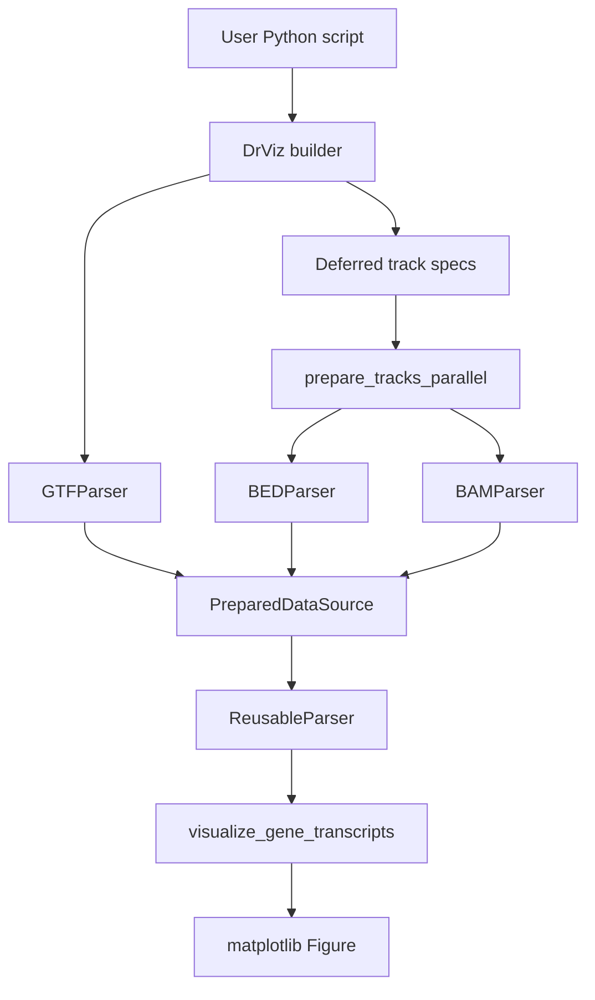
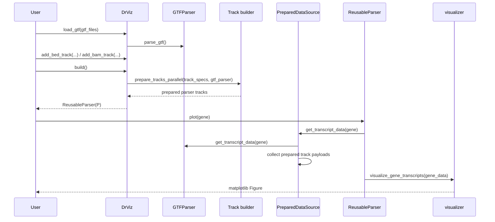
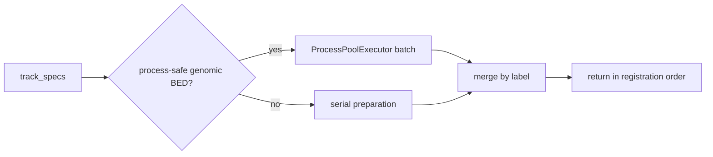
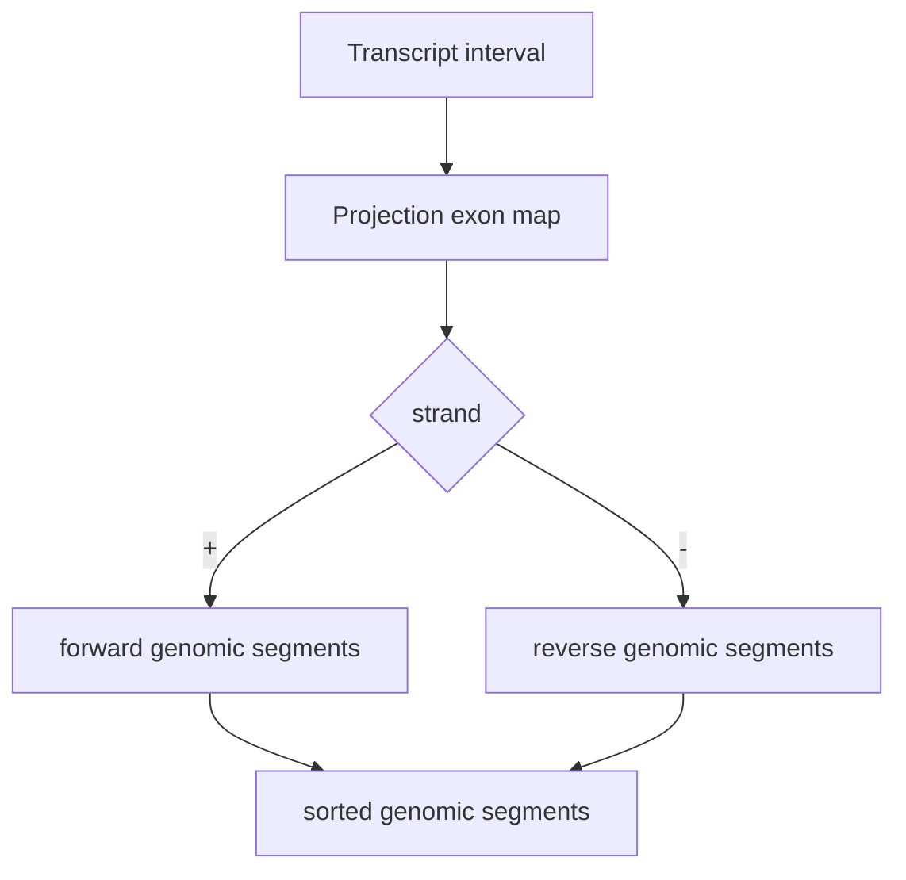

# drVizer System Architecture

## Architecture overview

drVizer is a small layered Python library:

1. Public builder API collects user intent.
2. Parsers load and normalize GTF, BED, and BAM inputs.
3. Build helpers prepare tracks while preserving registration order.
4. Data-source logic combines gene data and track payloads.
5. The visualizer renders a matplotlib figure.



## Public API layer

`DrViz` is the only public object exported by the package root.

```python
from drvizer import DrViz
```

`DrViz` stores:

- `gtf_parser`: loaded `GTFParser` instance.
- `track_specs`: deferred BED/BAM track specifications.
- `track_configs`: display metadata used later by `ReusableParser`.

`build()` freezes those specs into parser objects and returns `ReusableParser`.

## Data flow



## Parser responsibilities

### GTFParser

Owns transcript model state and coordinate conversion.

Inputs:

- GTF path or list of paths.
- Optional gzip-compressed GTF files.

Outputs:

- gene-level transcript data for plotting.
- transcript-to-gene lookup data.
- transcript-coordinate to genomic segment projections.

State:

- `gene_transcripts`
- `gene_info`
- `gene_name_to_id`
- `transcript_to_gene`
- `_parsed`

### BEDParser

Owns annotation intervals.

Inputs:

- BED path or list of paths.
- parser mode: `distribution` or `score`.
- optional transcript-coordinate mode.

Outputs:

- genomic annotations grouped by chromosome.
- region-filtered annotations.
- annotations grouped by transcript for split transcript tracks.

### BAMParser

Owns coverage arrays.

Inputs:

- BAM path or list of paths.
- aggregation mode: `sum` or `mean`.
- optional transcript-coordinate mode.

Outputs:

- genomic coverage arrays.
- transcript-coordinate projected coverage arrays.
- coverage grouped by transcript for split transcript tracks.

## Track preparation model

Track registration is deferred. `DrViz.add_bed_track(...)` and `DrViz.add_bam_track(...)` record specs but do not immediately create all parser objects. `DrViz.build()` calls `prepare_tracks_parallel(...)` to instantiate and prepare tracks.



Genomic BED tracks can be prepared in worker processes. BAM and transcript-coordinate tracks stay serial because they depend on pysam, GTF parser state, or transcript projection.

## Coordinate systems

### Genomic coordinates

- GTF exons/CDS are stored in genomic coordinates from input GTF rows.
- Genomic BED records use BED-style half-open interval filtering.
- Genomic BAM coverage uses per-base region arrays over `[start, end)`.

### Transcript coordinates

Transcript-coordinate BED and BAM inputs use transcript IDs as reference names. GTFParser projects transcript intervals back to genomic exon segments:



Split transcript tracks use projected data per transcript and then choose ordering:

- `nc`: transcript-major ordering.
- `cn`: track-major ordering.

## Rendering model

`visualize_gene_transcripts(...)` renders one axis for transcript structures plus one axis per prepared track.

Track kinds:

- `distribution`: interval blocks grouped by annotation name.
- `score`: numeric BED scores as bars.
- `coverage`: BAM-derived coverage lines/fills.

Shared y-axis scaling is computed from prepared numeric tracks. For split transcript tracks, the grouping key includes transcript ID, so each transcript gets independent scaling within a shared group.

## Error handling boundaries

- Public API validates user-facing options such as split modes, layer order, y-axis grouping, color/alpha length, and required GTF loading.
- Parser constructors validate path argument types and aggregation modes.
- File read errors are wrapped as `ValueError` at parser boundaries.
- Parallel BAM failures become `ParallelCoverageError` and can fall back to serial coverage.

## Performance model

- GTF parsing processes chunks instead of loading the whole file as one object.
- Optional Cython helpers accelerate GTF attribute parsing, GTF chunk parsing, transcript projection, and BED parsing.
- Genomic BED tracks can be prepared in a process pool.
- Multi-BAM genomic coverage can be aggregated in parallel with capped worker count.
- Long coverage arrays are binned before rendering.

## Extension points

The natural extension points are:

- new parser types inside the existing track spec/build pipeline;
- additional numeric track rendering in `visualizer.py`;
- additional Cython acceleration while preserving Python fallbacks;
- richer public documentation around supported input formats and examples.
